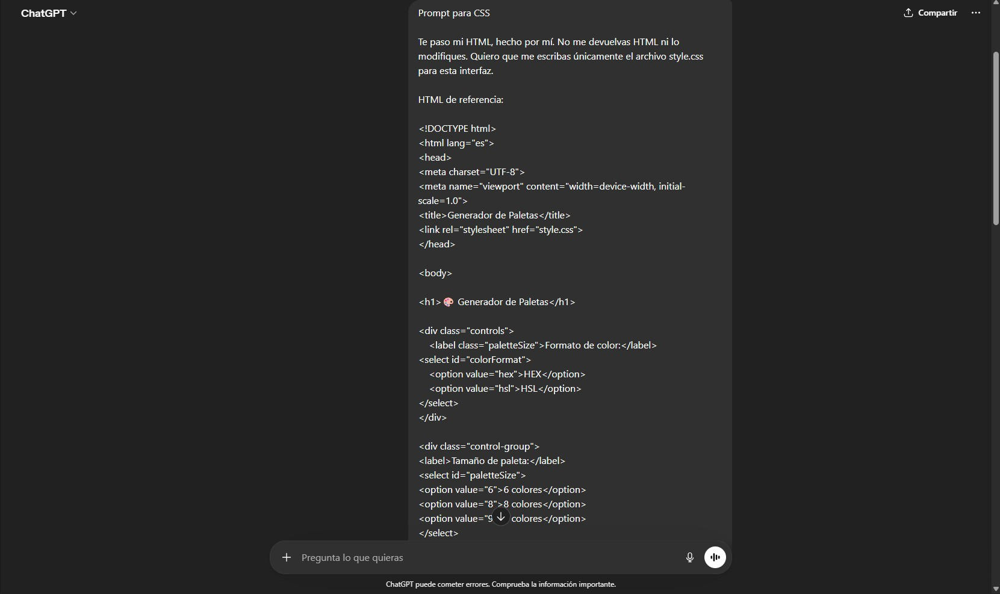
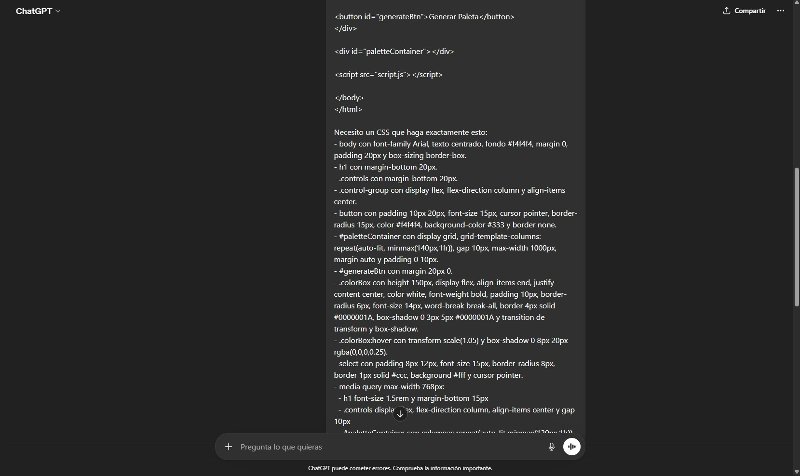
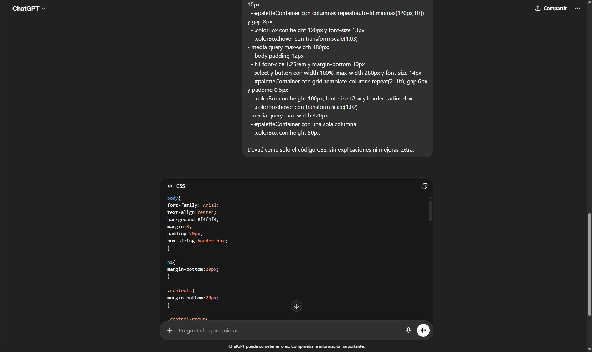
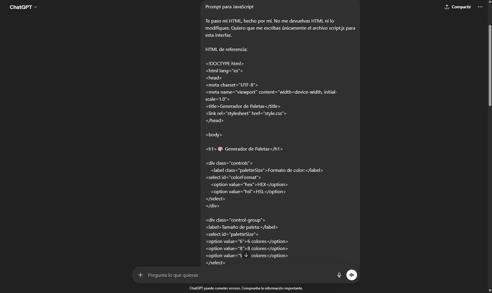
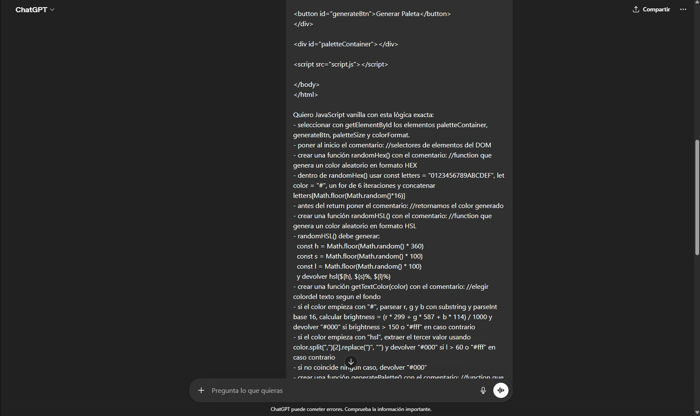
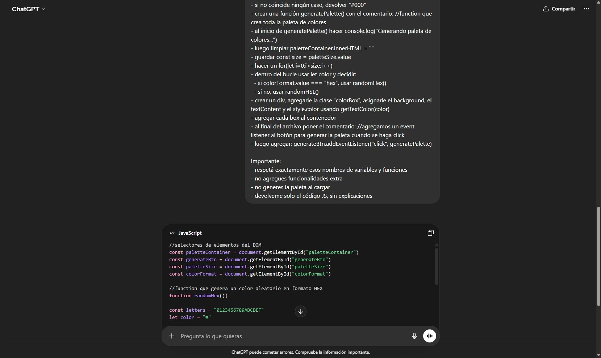

# Generador de paleta de colores

## Descripcion

Pagina web que genera una paleta de colores aleatoria a base de que formato de color elija el usuario (HEX o HSL).

---

## Instrucciones de uso

1. Clona o descarga el repositorio 
2. Abre el archivo index.html en tu navegador 
3. Selecionar:
     - Formato de color (HEX o HSL).
     - Tamaño de la paleta (6, 8 0 9 colores).
4. Hacer click en "Generar Paleta"
5. Ver los colores generados en la pantalla

---

## Tecnologias utilizadas 

- HTML5: para estructurar la aplicacion 
- CSS3: para estilos y responsive 
- JavaScript: para logica de generador de colores y manipulacion del DOM

---

## Desiciones tecnicas tomadas para el proyecto 

### Uso de JavaScript 

Proyecto simple enfocado en la manipulacion del DOM 

### Genarador de colores

- HEX: generador aleatorio con sus respectivos caracteres (0-F, 0-9)
- HSL: valores aleatorios de tono, saturacion y luz (Hue 0-360%, Saturation 0-100% y Lightness 0-100%)

### Texto dinamico 

Se uso una funcion para que el texto del color se ajuste dependiendo su fondo y su formato 

### CSS3

Uso para dar estilos, animaciones y modo responsive 

- animacion en CSS3 para interaccion pasando el cursor por encima del color generado (hover)

- utilizacion de CSS Grid y Media Queries para la adaptacion de dispositvos moviles 

- uitilizacion de CSS para dar bordes y sombras para diferenciar el fondo con el color genarador (colores claros)

### HTML5

Uso para estructuracion de la pagina mediante etiquetas 

- utilizacion de selectores (select), etiqueta (label) y opciones (option) para elegir opciones de formato de color y/o tamaño de la paleta 

- usamos etiqueta (div) para estrucuturar la interfaz y mostrar dinamicamente los colores generados 

---

## Esttructura del proyecto 

proyecto/

├── index.html

├── style.css

└── script.js

--- 

## Deployment en GitHub Pages

- la pagina esta desplagada en GitHub Pages 

---

### Autor de proyecto 

- Proyecto realizado y publicado por Franco Sosa para el proyecto integrado del modulo 1 SoyHenry (PI-1)

- Uso con fines educativos 
 
---

## Prompt de ChatGPT

A continuación se incluyen las imágenes relacionadas que están en la carpeta `assets/images`:

